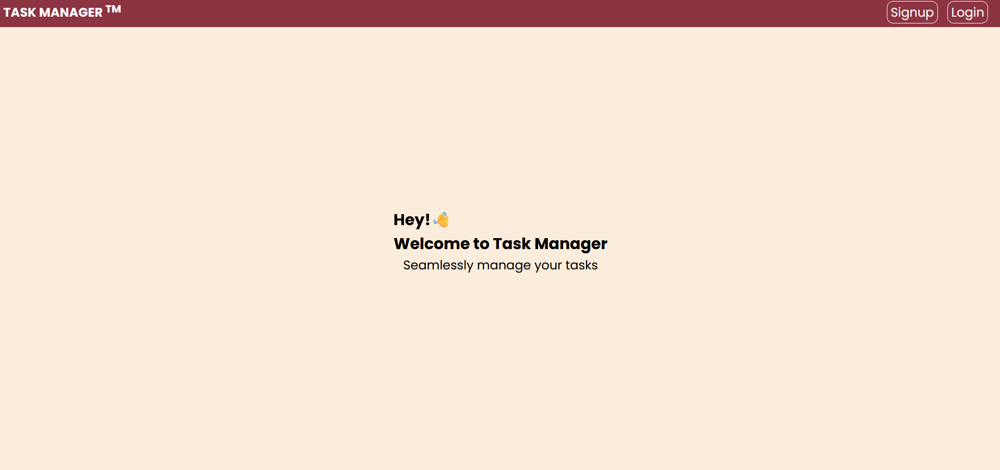
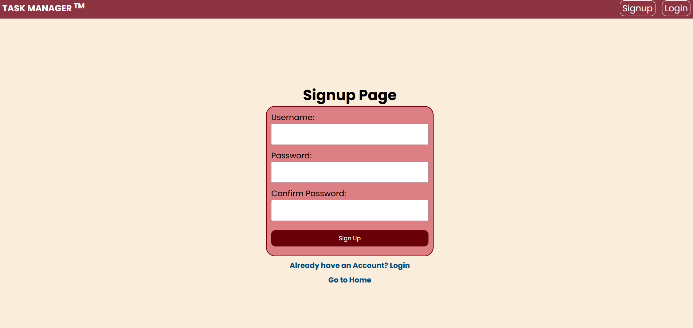
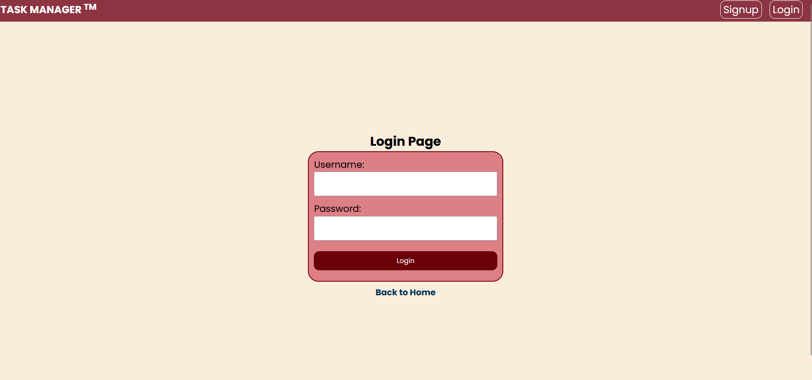
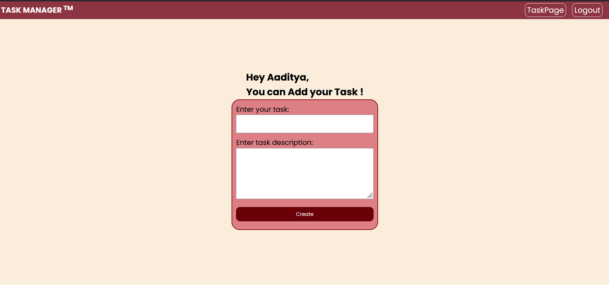
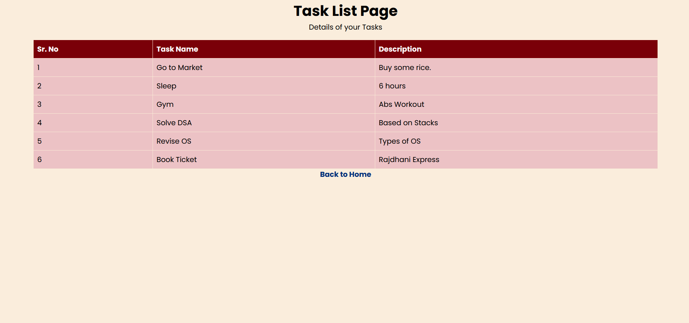

# Task Manager WebApp

## Getting Started

To get started with this project, follow these steps:

1. **Clone the repository**: `git clone https://github.com/Aaditya-S6/Task-Manager-WebApp`
2. **Change into the frontend directory**: `cd frontend`
3. **Install dependencies**: `npm i`
4. **Start the frontend server**: `npm run serve`
5. **Change into the backend directory**: `cd backend`
6. **Install dependencies**: `npm i`
7. **Start the backend server**: `npm start`

## Screenshots

### Homepage

### Signup Page

### Login Page

### Add task form

### All tasks List

## Tips

* Make sure you have Node.js and npm installed on your machine.
* If you encounter any issues with the installation or running of the application, try deleting the `node_modules` directory and running `npm i` again.
